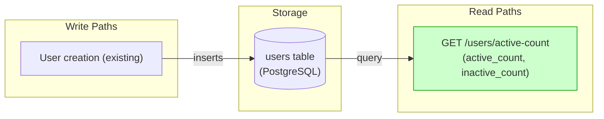

# Implementation Guide: Active Count Endpoint

This feature implements a read-only endpoint to monitor user activity by returning counts of active and inactive users.

## Architecture

The endpoint follows the project's feature-based module structure.

*Data flow diagram: Write path from user creation to storage, and read path from storage to the new endpoint.*

## Data Flow: Read/Write Paths

*Data flow diagram: Write path from user creation to storage, and read path from storage to the new endpoint.*

## §4: Integration Contracts

No cross-task data dependencies identified for this feature. All tasks are independent.