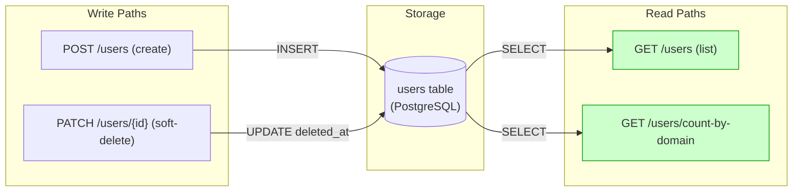
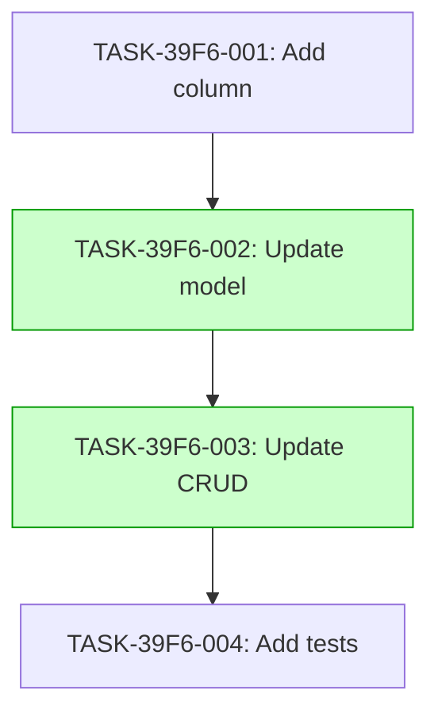

# Implementation Guide: Add deleted_at column to users table

This feature implements soft-delete support for the users table by adding a nullable `deleted_at` timestamp column.

## Architecture

The following diagram shows the data flow for this feature.

*Data flow: Write paths to the users table and corresponding read paths.*

## Integration Contracts

This feature has no cross-task data dependencies.

## Task Dependencies

*Tasks with green background can run in parallel.*

## Execution Strategy

Wave 1: 1 task (sequential)
  ⚡ Conductor recommended
     • TASK-39F6-001: Add column (direct, wave1-1)

Wave 2: 1 task (sequential)
  ⚡ Conductor recommended
     • TASK-39F6-002: Update model (direct, wave2-1)

Wave 3: 1 task (sequential)
  ⚡ Conductor recommended
     • TASK-39F6-003: Update CRUD (task-work, wave3-1)

Wave 4: 1 task (sequential)
  ⚡ Conductor recommended
     • TASK-39F6-004: Add tests (task-work, wave4-1)