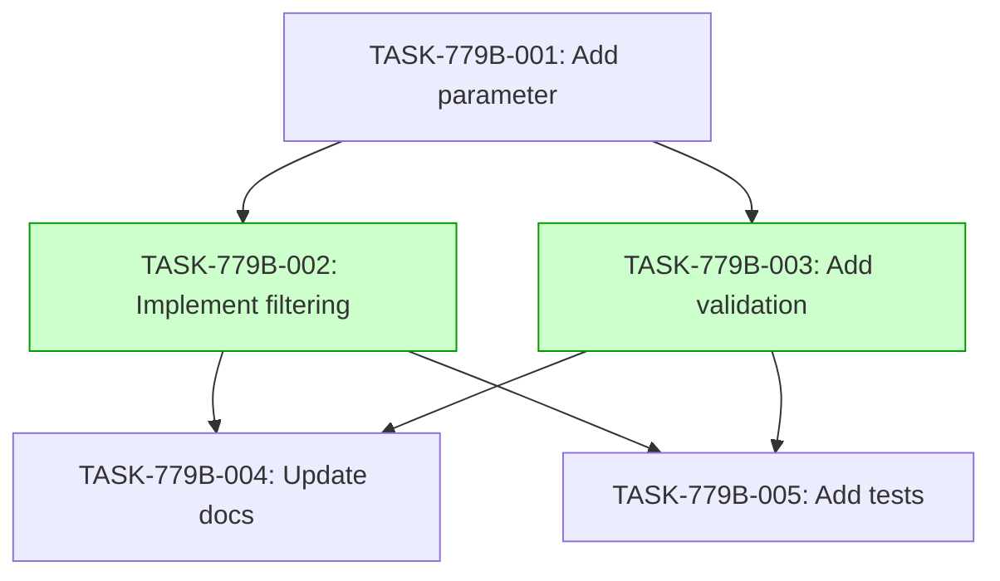

# Implementation Guide: Add min_count query parameter

This guide outlines the implementation approach for adding the `min_count` query parameter to the `GET /users/count-by-domain` endpoint.

## Architecture Decisions

The following decisions were made during planning. All implementation tasks should align with these approaches.

- **Approach**: Add `min_count` as an optional integer query parameter with validation for non-negative values and a maximum limit.
- **Data Flow**: The parameter is passed from the endpoint handler to the service layer, which applies the filter to the domain count query.
- **Testing Strategy**: Add Hurl tests covering happy-path, boundary, and negative cases.

## Integration Contracts

No cross-task data dependencies identified for this feature.

## Task Dependencies

_Tasks with green background can run in parallel._

## Execution Strategy

Wave 1: 1 task (foundation)
  ⚡ Conductor recommended
     • TASK-779B-001: Add min_count parameter (direct, wave1-1)

Wave 2: 2 tasks (parallel execution)
  ⚡ Conductor recommended
     • TASK-779B-002: Implement filtering logic (task-work, wave2-1)
     • TASK-779B-003: Add input validation (task-work, wave2-2)

Wave 3: 1 task (parallel execution)
  ⚡ Conductor recommended
     • TASK-779B-004: Update API documentation (direct, wave3-1)

Wave 4: 1 task (parallel execution)
  ⚡ Conductor recommended
     • TASK-779B-005: Add integration tests (task-work, wave4-1)

## Deferred Planning Decisions

| decision point | chosen default | status |
|----------------|----------------|--------|
| review_focus | all | deferred |
| trade_off_priority | balanced | deferred |
| implementation_approach | recommended | deferred |
| execution_preference | auto-detect | deferred |
| testing_depth | default | deferred |