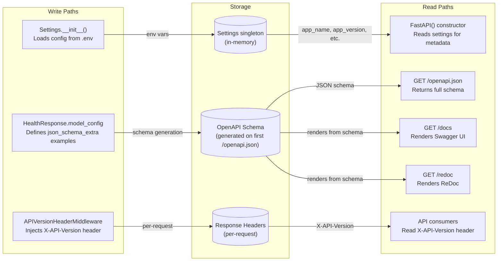
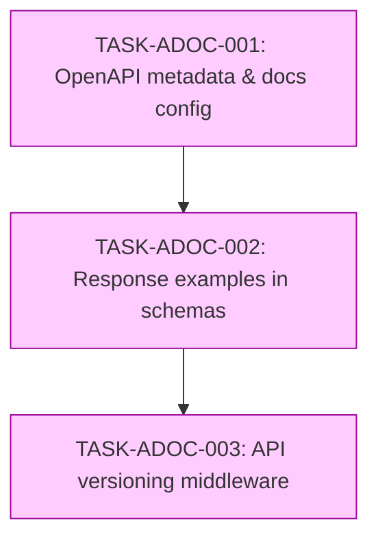
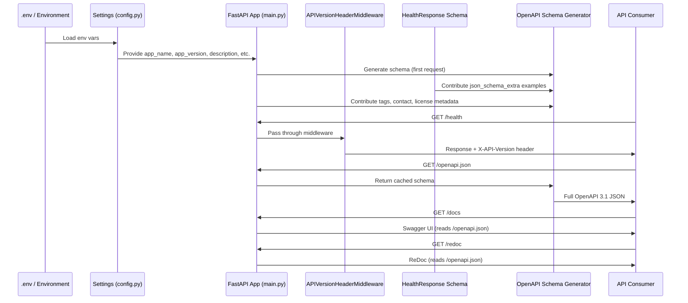

# Implementation Guide: API Documentation Feature

**Feature ID**: FEAT-7158
**Parent Review**: TASK-REV-7158
**Approach**: Option 1 - FastAPI Built-in OpenAPI Customization
**Execution**: Sequential (3 waves)
**Testing**: Standard (quality gates)

## Overview

This feature adds comprehensive API documentation to the FastAPI application using only built-in FastAPI and Pydantic v2 capabilities. No new dependencies are required.

## Data Flow: Read/Write Paths

_All write paths have corresponding read paths. No disconnections detected._

## Task Dependencies

_Sequential execution: each task builds on the previous. No parallel opportunities due to shared file modifications in main.py and tight logical coupling._

## Integration Contract: Sequence

_Data flows end-to-end from environment configuration through to API consumer. No "fetch then discard" patterns._

## Execution Strategy

### Wave 1: TASK-ADOC-001 - Customize OpenAPI metadata and Swagger/ReDoc configuration
- **Mode**: task-work
- **Complexity**: 3/10
- **Files modified**: `src/main.py`, `src/core/config.py`, `tests/test_main.py`
- **Approach**: Add OpenAPI parameters to `FastAPI()` constructor, add settings fields

### Wave 2: TASK-ADOC-002 - Add response examples to Pydantic schemas
- **Mode**: task-work
- **Complexity**: 3/10
- **Files modified**: `src/health/schemas.py`, `src/health/router.py`, `tests/health/test_router.py`
- **Approach**: Add `json_schema_extra` examples and `Field(description=...)` to schemas, add endpoint `summary`/`description`/`responses`

### Wave 3: TASK-ADOC-003 - Add API versioning headers middleware
- **Mode**: task-work
- **Complexity**: 3/10
- **Files created**: `src/core/middleware.py`
- **Files modified**: `src/main.py`, `tests/test_main.py`
- **Approach**: Create `BaseHTTPMiddleware` subclass, register in app

## Key Decisions

| Decision | Choice | Rationale |
|----------|--------|-----------|
| Versioning strategy | Header-based (`X-API-Version`) | Non-breaking, no route changes, appropriate for single-version API |
| Example format | Pydantic v2 `json_schema_extra` | Native pattern, no dependencies, upgrade-safe |
| Middleware pattern | `BaseHTTPMiddleware` | Simplest pattern for header injection, included with FastAPI |
| New dependencies | None | All functionality available in FastAPI + Pydantic v2 built-ins |

## Risks and Mitigations

| Risk | Likelihood | Impact | Mitigation |
|------|-----------|--------|------------|
| Examples go stale | Low | Low | Examples are adjacent to schema code; PR reviews catch drift |
| Middleware performance | Very Low | Low | Single header addition has negligible overhead |
| Settings proliferation | Low | Low | Group docs settings logically; they rarely change |

## Quality Gates

- All existing tests must continue to pass
- New tests for each task verify documentation output
- `ruff check` and `mypy` must pass
- Minimum 80% line coverage maintained

## Next Steps After Completion

Once all 3 tasks are complete, the API will have:
- Rich metadata at `/docs` and `/redoc`
- Response examples visible in both UIs
- `X-API-Version` header on every response
- A patterns established for documenting all future endpoints
