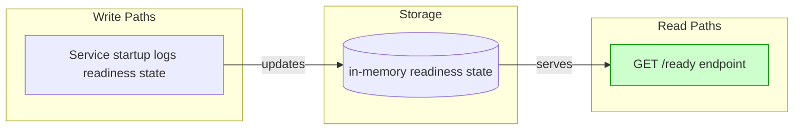
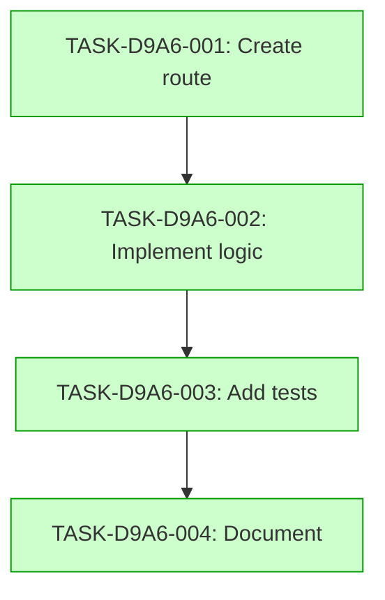

# Implementation Guide: API Test Ready Endpoint

## Overview

This feature implements a readiness endpoint on the api_test service.

## Data Flow

## Task Dependencies

## Execution Strategy

Wave 1: TASK-D9A6-001 (direct)
Wave 2: TASK-D9A6-002 (task-work)
Wave 3: TASK-D9A6-003 (direct)
Wave 4: TASK-D9A6-004 (direct)

## Deferred Planning Decisions

| decision_point | chosen_default | status |
|---|---|---|
| review_scope_focus | all | deferred |
| review_depth | standard | deferred |
| trade_off_priority | balanced | deferred |
| implementation_approach | recommended | deferred |
| execution_preference | detect_automatically | deferred |
| testing_depth | default_by_complexity | deferred |
