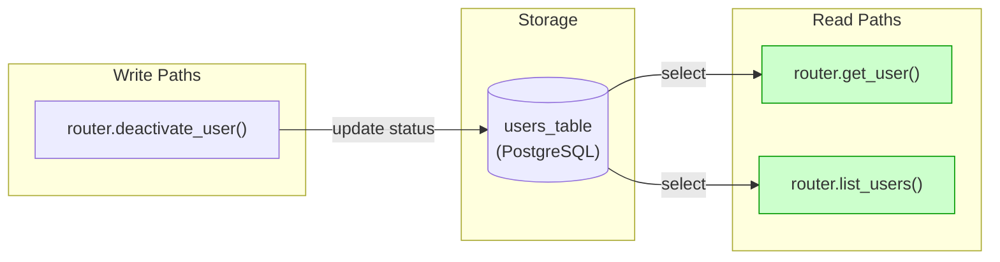

# Implementation Guide: Deactivate User Endpoint

This feature implements the user deactivation endpoint.

## Architecture

The feature follows the project's architecture:
- **Router**: `src/users/router.py` declares the endpoint
- **CRUD**: `src/users/crud.py` implements the deactivation logic
- **Schemas**: `src/users/schemas.py` defines the response shape
- **Models**: `src/users/models.py` contains the User model

## Data Flow


*All read paths are wired to the write path.*

## §4: Integration Contracts

```markdown
## §4: Integration Contracts

### Contract: user_deactivation_response
- **Producer task:** TASK-2FDE-001
- **Consumer task(s):** TASK-2FDE-003
- **Artifact type:** HTTP response body
- **Format constraint:** JSON object containing the updated user with `is_active: false`
- **Validation method:** Hurl test asserting status 200 and `is_active` field
```