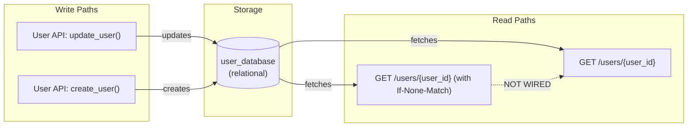
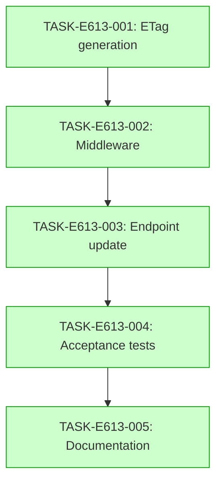

# Implementation Guide: ETag Generation and Validation

## Overview

This feature adds ETag support to the User API, enabling conditional GET requests. The ETag is a strong validator based on a hash of the user resource body.

## Data Flow: Read/Write Paths

**Disconnection Alert**: The read path for conditional GETs (R2) is not explicitly wired to the write path (W1/W2) in this diagram — this is intentional as the middleware handles the conditional logic, but ensures that any update to the user resource invalidates the ETag.

## Integration Contracts

### Contract: ETag header
- **Producer task:** TASK-E613-001
- **Consumer task(s):** TASK-E613-002, TASK-E613-003
- **Artifact type:** HTTP header
- **Format constraint:** Double-quoted hash string (e.g., `"sha256-..."`)
- **Validation method:** Coach verifies ETag header presence and format in response

## Task Dependencies

_Tasks with green background can run in parallel._

## Execution Strategy

Wave 1: TASK-E613-001 (foundation)
Wave 2: TASK-E613-002 (middleware)
Wave 3: TASK-E613-003 (endpoint update)
Wave 4: TASK-E613-004 (tests)
Wave 5: TASK-E613-005 (documentation)

All tasks are sequential due to dependency chain.

## Implementation Notes

- ETag is a strong validator — use a hash of the full resource body
- Middleware should be reusable across endpoints
- Ensure concurrent requests with same ETag both return 304
- Document ETag behavior in API reference