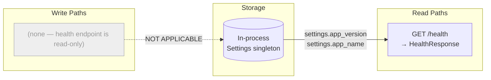
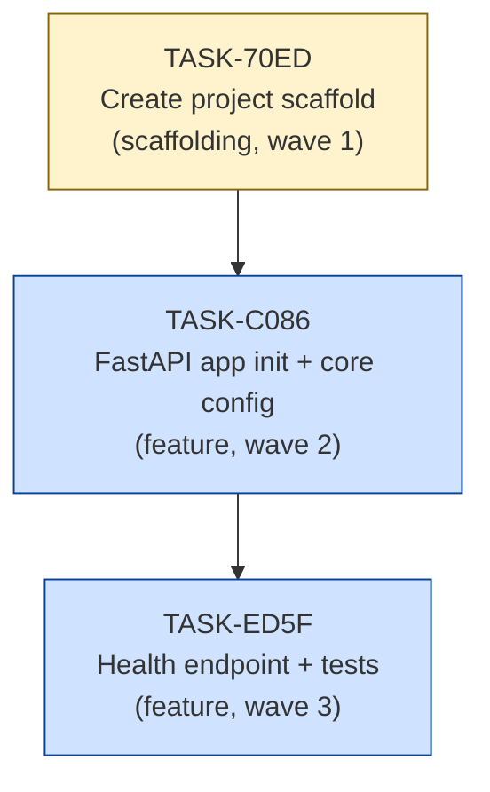

# Implementation Guide: FastAPI App with Health Endpoint

**Feature**: FEAT-HEALTH
**Review task**: TASK-21B6
**Approach**: Option 2 — Full Template Structure
**Execution**: Sequential (Wave 1 → 2 → 3)
**Testing**: Standard (implement + tests together)

---

## Data Flow: Read/Write Paths



_This feature has no write paths. The only data source is the in-process `Settings` singleton, which is populated at startup from environment variables / `.env`. All paths are read-only._

---

## Task Dependency Graph



_Tasks are strictly sequential — each task depends on the previous. Yellow = scaffolding, blue = feature._

---

## Execution Strategy

### Wave 1 — Scaffold
**Task**: TASK-70ED
**Mode**: task-work
No parallelism — single foundation task.

```
tasks/backlog/fastapi-health-endpoint/TASK-70ED-create-project-scaffold.md
```

Deliverables:
- `pyproject.toml`
- `requirements/base.txt`, `requirements/dev.txt`
- Empty `src/`, `src/health/`, `src/core/`, `tests/`, `tests/health/` with `__init__.py`
- `.env.example`

---

### Wave 2 — App Init
**Task**: TASK-C086
**Mode**: task-work
Depends on TASK-70ED.

```
tasks/backlog/fastapi-health-endpoint/TASK-C086-implement-fastapi-app-init-and-core-config.md
```

Deliverables:
- `src/core/config.py` — `Settings(BaseSettings)`
- `src/main.py` — `FastAPI` app instance (no routers yet)

---

### Wave 3 — Endpoint + Tests
**Task**: TASK-ED5F
**Mode**: task-work
Depends on TASK-C086.

```
tasks/backlog/fastapi-health-endpoint/TASK-ED5F-implement-health-endpoint-and-tests.md
```

Deliverables:
- `src/health/schemas.py` — `HealthResponse`
- `src/health/router.py` — `GET /health`
- `src/main.py` updated — router included
- `tests/conftest.py` — `async_client` fixture
- `tests/health/test_router.py` — HTTP-level tests

---

## Expected Final Project Structure

```
.
├── pyproject.toml
├── requirements/
│   ├── base.txt
│   └── dev.txt
├── .env.example
├── src/
│   ├── __init__.py
│   ├── main.py
│   ├── core/
│   │   ├── __init__.py
│   │   └── config.py
│   └── health/
│       ├── __init__.py
│       ├── router.py
│       └── schemas.py
└── tests/
    ├── __init__.py
    ├── conftest.py
    └── health/
        ├── __init__.py
        └── test_router.py
```

---

## Key Design Decisions

| Decision | Choice | Rationale |
|----------|--------|-----------|
| Project structure | Feature-based (`src/health/`) | Matches CLAUDE.md template; adding auth = new feature folder |
| Settings | `pydantic-settings` `BaseSettings` | Type-safe, env-var-driven, Pydantic v2 compatible |
| Test client | `httpx.AsyncClient` + `ASGITransport` | Async-compatible, works with `pytest-asyncio` |
| Health response | `{"status": "ok", "version": "0.1.0"}` | Minimal, no DB ping needed at this stage |
| Startup hooks | `lifespan` context manager | Avoids deprecated `on_event`; ready for DB connections later |

---

## Quality Gates

| Check | Tool | Target |
|-------|------|--------|
| Linting | `ruff check .` | Zero errors |
| Formatting | `ruff format --check .` | Zero diffs |
| Type checking | `mypy src/` (strict) | Zero errors |
| Tests | `pytest` | All pass |
| Line coverage | `pytest --cov=src` | ≥ 80% |
| Branch coverage | `pytest --cov=src --cov-branch` | ≥ 75% |

---

## Next Steps After Completion

Once all 3 tasks are complete, the app is ready to extend:

- **Auth feature**: Add `src/auth/` with JWT middleware (no restructuring needed)
- **Database**: Add `src/db/session.py` + asyncpg, update health endpoint to ping DB
- **Users feature**: Add `src/users/` with full CRUD stack
