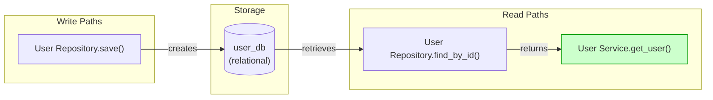
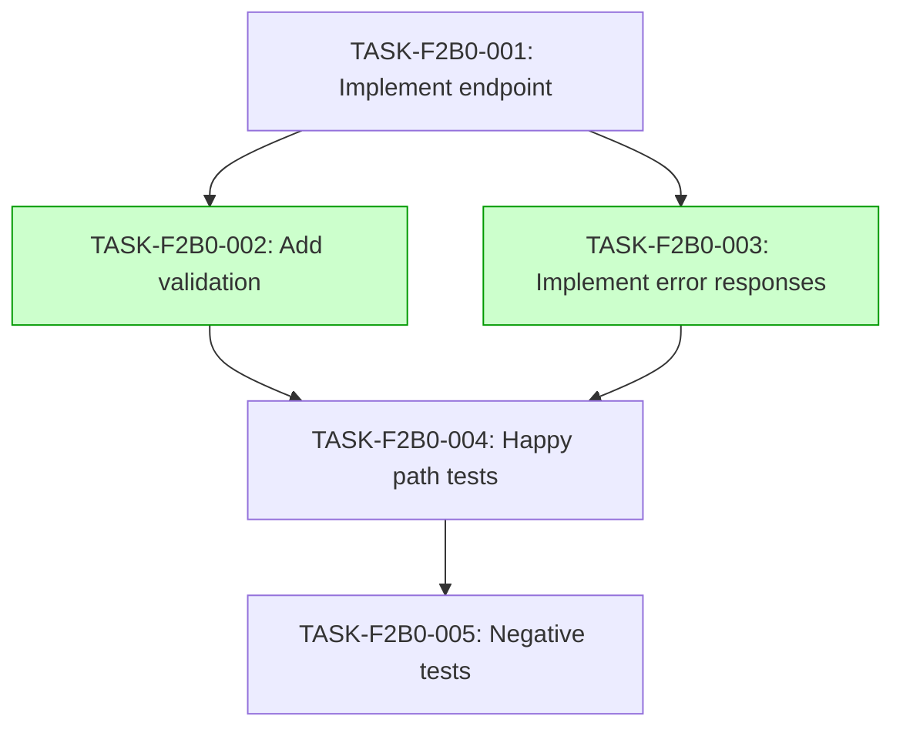

# Implementation Guide: Get User by ID Endpoint

## Overview

This feature implements the `GET /users/{id}` endpoint, enabling clients to retrieve user details by their unique identifier. The implementation covers happy-path retrieval, boundary validation, error handling, and negative cases.

## Data Flow

*Data flow diagram: shows the write path to user storage and the corresponding read path.*

## Task Dependencies

*Tasks in green can run in parallel.*

## Execution Strategy

**Wave 1**
- TASK-F2B0-001: Implement user retrieval endpoint (direct)

**Wave 2**
- TASK-F2B0-002: Add ID validation logic (direct)
- TASK-F2B0-003: Implement error responses (task-work)

**Wave 3**
- TASK-F2B0-004: Add happy path tests (direct)

**Wave 4**
- TASK-F2B0-005: Add negative tests (direct)

## Smoke Gates

The feature includes a smoke gate that runs after Wave 4:
`pytest tests/acceptance/test_get_user_by_id.py -x`

## Integration Contracts

### Contract: user_repository
- **Producer task:** TASK-F2B0-001
- **Consumer task(s):** TASK-F2B0-001 (internal component)
- **Artifact type:** repository interface
- **Format constraint:** returns User domain model or raises NotFound
- **Validation method:** unit tests for repository implementation
