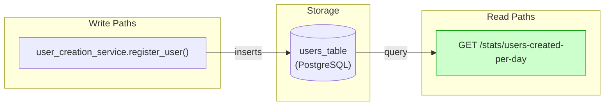
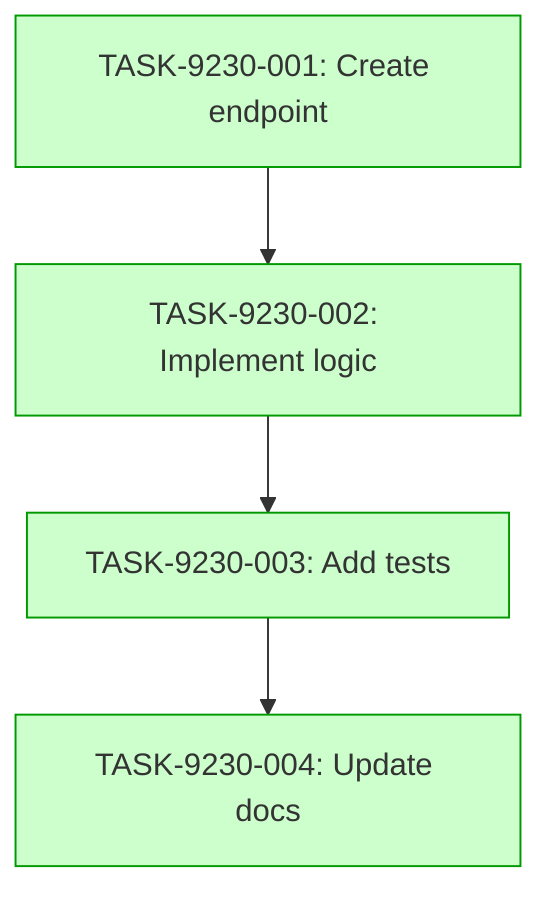

# Implementation Guide: Get Users Created Per Day

This feature implements a new analytics endpoint that returns user creation statistics for the last 7 days.

## Architecture

The endpoint is implemented as a new route in the `stats` module, following the existing feature-based module structure.


*Data flow: user registration writes to the users table, which the statistics endpoint reads.*

## Integration Contracts

```markdown
## §4: Integration Contracts

### Contract: USER_CREATION_STATS
- **Producer task:** TASK-9230-002
- **Consumer task(s):** TASK-9230-003
- **Artifact type:** JSON response body
- **Format constraint:** List of objects with `date` (ISO 8601) and `count` (integer), exactly 7 elements, ordered oldest first
- **Validation method:** Coach verifies response structure and count in integration tests
```

## Task Dependencies


*Tasks with green background can run in parallel.*

## Implementation Strategy

Wave 1: TASK-9230-001 (direct)
Wave 2: TASK-9230-002 (task-work)
Wave 3: TASK-9230-003 (direct)
Wave 4: TASK-9230-004 (direct)

## Deferred Planning Decisions

| decision point | chosen default | status |
|---|---|---|
| review_focus | all | deferred |
| trade_off_priority | balanced | deferred |
| implementation_approach | recommended | deferred |
| execution_preference | auto-detect | deferred |
| testing_depth | default | deferred |