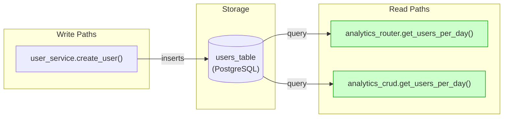
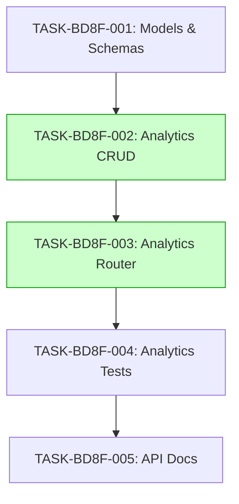

# Implementation Guide: Get Users Created Per Day

This feature implements an analytics endpoint to track user registration trends.

## Architecture

The feature follows the project's modular architecture. All modified files are located within `src/users/` or `src/analytics/` (if a new module is created).


*Data flow: Write path (user creation) flows into storage, which is read by the analytics endpoint.*

## Integration Contracts

```markdown
## §4: Integration Contracts

### Contract: user_creation_event
- **Producer task:** TASK-BD8F-001
- **Consumer task(s):** TASK-BD8F-002
- **Artifact type:** user record in database
- **Format constraint:** user record must have `created_at` timestamp
- **Validation method:** Coach verifies `analytics_crud.get_users_per_day` queries the user table
```

## Task Dependencies


*Tasks with green background can run in parallel.*

## Execution Strategy

Wave 1: 1 task
  ⚡ Conductor recommended
     • TASK-BD8F-001: Create models (direct, wave1-1)

Wave 2: 2 tasks (parallel)
  ⚡ Conductor recommended
     • TASK-BD8F-002: Implement CRUD (task-work, wave2-1)
     • TASK-BD8F-003: Create router (direct, wave2-2)

Wave 3: 1 task
  ⚡ Conductor recommended
     • TASK-BD8F-004: Add tests (task-work, wave3-1)

Wave 4: 1 task
  ⚡ Conductor recommended
     • TASK-BD8F-005: Update docs (direct, wave4-1)