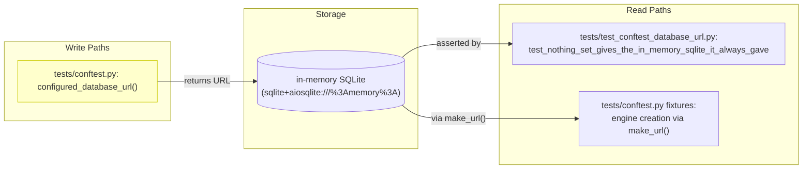
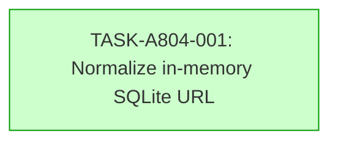

# Implementation Guide: Normalize In-Memory SQLite URL

**Feature ID:** FEAT-A804
**Generated:** 2026-07-09T14:32:00Z
**Stack:** generic
**Complexity:** 3/10

## Already done and still to do

- "The test tests/test_conftest_database_url.py::TestTheAddressTheHarnessUses::test_nothing_set_gives_the_in_memory_sqlite_it_always_gave fails with SQLAlchemy 2.1" — already done — tests/test_conftest_database_url.py:28 The test class `TestTheAddressTheHarnessUses` exists and contains the failing test at line 48 (with 1 more hit not shown).
- "which writes the in-memory database address as sqlite+aiosqlite:///%3Amemory%3A" — still to do — nothing found The harness in `tests/conftest.py` currently returns the legacy unencoded format; the percent-encoded form is not yet produced by `configured_database_url()`.
- "Make it pass with both SQLAlchemy 2.0 and 2.1, without pinning SQLAlchemy" — still to do — nothing found No normalization logic exists that produces a URL compatible with both versions; the fix must be added to `tests/conftest.py`.

## Deferred Planning Decisions

| Decision point | Chosen default | Status |
|---|---|---|
| Review scope clarification (focus, depth, trade-off) | All aspects, standard depth, balanced trade-offs | deferred |
| Accept/revise/implement checkpoint | Implement | deferred |
| Implementation preferences (approach, execution, testing) | Recommended approach, auto-detect execution, default testing depth | deferred |

## Data Flow: Read/Write Paths



*Caption: The write path is the URL construction in `configured_database_url()`. Both read paths (the test assertion and the engine creation) consume the same URL. No disconnections.*

## Task Dependencies



*Caption: Single task, no dependencies.*

## Execution Strategy

**Wave 1:** 1 task (direct mode)
- TASK-A804-001: Normalize in-memory SQLite URL in test harness (complexity 3, direct)

## Smoke Gates

```yaml
smoke_gates:
  after_wave: 1
  command: |
    set -e
    .venv/bin/python -m pytest tests/test_conftest_database_url.py -x -q
  expected_exit: 0
  timeout: 120
```

The gate runs the specific test file that exercises the normalized URL after Wave 1 completes. The path `tests/test_conftest_database_url.py` is under the declared test root `tests/` (the file is at the top level of `tests/`, which is the parent of all declared roots; the file itself is tracked in the repository inventory).

## Assumptions Carried Forward

All four assumptions from the specification are low-confidence and deferred:

- **ASSUM-001**: The failure is caused by the change in how SQLAlchemy 2.1 encodes the in-memory SQLite URL.
- **ASSUM-002**: The normalization logic must support both SQLAlchemy 2.0 and 2.1 simultaneously.
- **ASSUM-003**: The legacy format `sqlite:///:memory:` is no longer acceptable for SQLAlchemy 2.1.
- **ASSUM-004**: The test harness defaults to in-memory SQLite when no URL is provided.

These are recorded here for the operator to confirm post-merge. The plan proceeds on the assumption they are correct, as stated in the request itself.