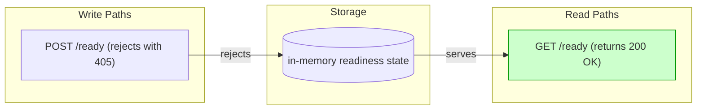
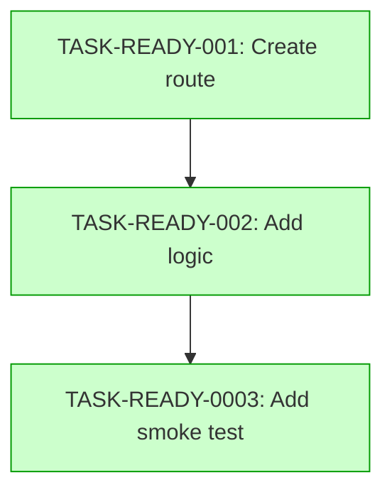

# Implementation Guide: Ready Endpoint

## Overview
This feature implements the readiness endpoint for the api_test service. The endpoint provides a signal for load balancers and orchestrators to determine service availability.

## Architecture

### Data Flow: Read/Write Paths

*Data flow diagram shows the readiness signal path. The write path (POST rejection) is handled within the application router.*

### Task Dependencies

*Tasks are sequenced to build the route foundation before adding logic and testing.*

## Implementation Strategy

### Wave 1: Foundation
- TASK-READY-001: Create the route definition in the application router.

### Wave 2: Logic
- TASK-READY-002: Implement the readiness check logic and response formatting.

### Wave 3: Verification
- TASK-READY-003: Add the smoke test to verify both happy and negative scenarios.

## Deferred Planning Decisions

| decision_point | chosen_default | status |
|----------------|----------------|--------|
| review_scope_focus | all | deferred |
| review_scope_depth | standard | deferred |
| review_scope_tradeoff | balanced | deferred |
| implementation_approach | recommended | deferred |
| implementation_execution | detect_automatically | deferred |
| implementation_testing_depth | default_based_on_complexity | deferred |
| mode_boundary_normalization | direct_for_low_complexity | deferred |

## Engineering Notes

- The readiness check is intentionally simple: it verifies the process is alive without external dependency checks (per ASSUM-002).
- The POST rejection is the only method restriction specified (per ASSUM-001).
- All tests should be placed in `tests/health/` to align with existing test organization.