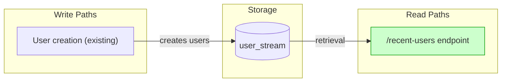
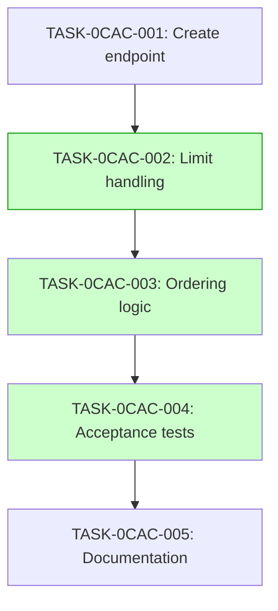

# Implementation Guide: Recent Users Endpoint

## Overview
This feature implements the `/recent-users` endpoint with limit handling and newest-first ordering.

## Data Flow

## Task Dependencies

## Implementation Strategy

Execute tasks sequentially across 4 waves. Parallel execution is recommended for tasks within the same wave if they don't share file conflicts.

## Deferred Planning Decisions

| Decision Point | Chosen Default | Status |
|----------------|----------------|--------|
| Review Focus | All aspects | deferred |
| Trade-off Priority | Balanced | deferred |
| Implementation Approach | Recommended option | deferred |
| Execution Preference | Auto-detect | deferred |
| Testing Depth | Default based on complexity | deferred |

## Operator follow-up tasks: 0