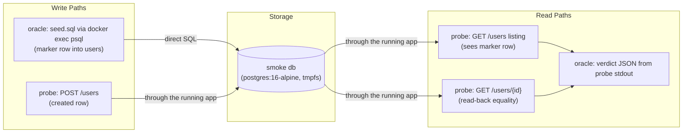
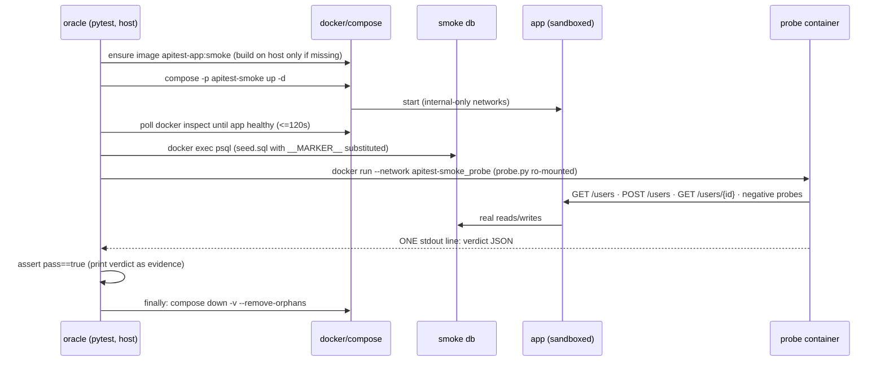
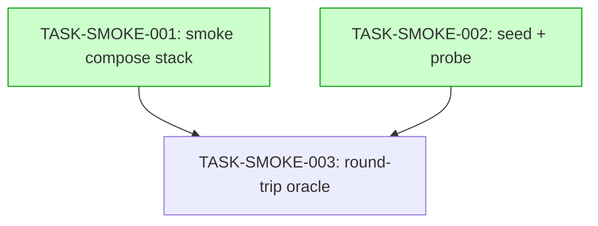

# Implementation Guide — Runtime smoke: seeded round-trip against a sandboxed deployment

Feature: FEAT-8737 · Parent review: TASK-REV-RSMK · 3 tasks, 2 waves.
Binding spec: docs/runtime-smoke-scope-and-buildplan.md (§3 constraints verbatim). Selected
approach: Option 1 — standalone smoke compose + self-contained pytest oracle + in-network
stdlib probe container.

## Data Flow: Read/Write Paths

*What to look for: both write paths land in the same real database and BOTH are read back
through the running service — no write is verified by the thing that wrote it. No
disconnected paths.*

## Integration Contracts (sequence)

*What to look for: every artifact retrieved is passed onward — the verdict JSON is consumed
by the oracle's assertion; nothing is fetched and discarded.*

## Task Dependencies

*Tasks with green background (wave 1) run in parallel — they touch disjoint files.*

## §4: Integration Contracts

### Contract: SMOKE_COMPOSE_FILE
- **Producer task:** TASK-SMOKE-001
- **Consumer task(s):** TASK-SMOKE-003
- **Artifact type:** compose file (`deploy/docker-compose.smoke.yml`)
- **Format constraint:** standalone (never layered on the base file); project `apitest-smoke`; services `app` (image `apitest-app:smoke`, no `build:`) + `db`; networks `backend`+`probe` both `internal: true`; zero `ports:`; no docker socket mounts
- **Validation method:** Coach greps the file for two `internal: true` networks, the image tag, and the absence of `ports:`/`build:`/`docker.sock`; `docker compose -f ... config` parses cleanly

### Contract: SEED_TEMPLATE
- **Producer task:** TASK-SMOKE-002
- **Consumer task(s):** TASK-SMOKE-003
- **Artifact type:** SQL template (`qa/smoke/seed.sql`)
- **Format constraint:** single INSERT into `users` with explicit id/email/full_name/is_active; literal `__MARKER__` token in email (`seeded-__MARKER__@smoke.local`) and full name — the oracle substitutes it per run
- **Validation method:** Coach verifies the `__MARKER__` token appears in both fields; oracle's seeded-listing check proves it end-to-end

### Contract: PROBE_VERDICT_JSON
- **Producer task:** TASK-SMOKE-002 (`qa/smoke/probe.py`)
- **Consumer task(s):** TASK-SMOKE-003
- **Artifact type:** stdout line from the probe container
- **Format constraint:** exactly one JSON line `{"pass": bool, "marker": str, "checks": [{"id", "pass", "detail"}...]}`; exit 0 iff all checks pass; diagnostics to stderr only
- **Validation method:** the seam test in TASK-SMOKE-002 (single parseable line, contract keys); the oracle parses with `json.loads` and asserts

## Execution strategy

Wave 1 (parallel): TASK-SMOKE-001 (direct) · TASK-SMOKE-002 (task-work).
Wave 2: TASK-SMOKE-003 (task-work) — consumes all three contracts above.
Feature smoke gate (after wave 2): the oracle itself runs end to end — the honest gate is the
deliverable. Coordinator's own done bar (scope §5): the oracle green by the coordinator's own
hand, twice in a row, before merge.
