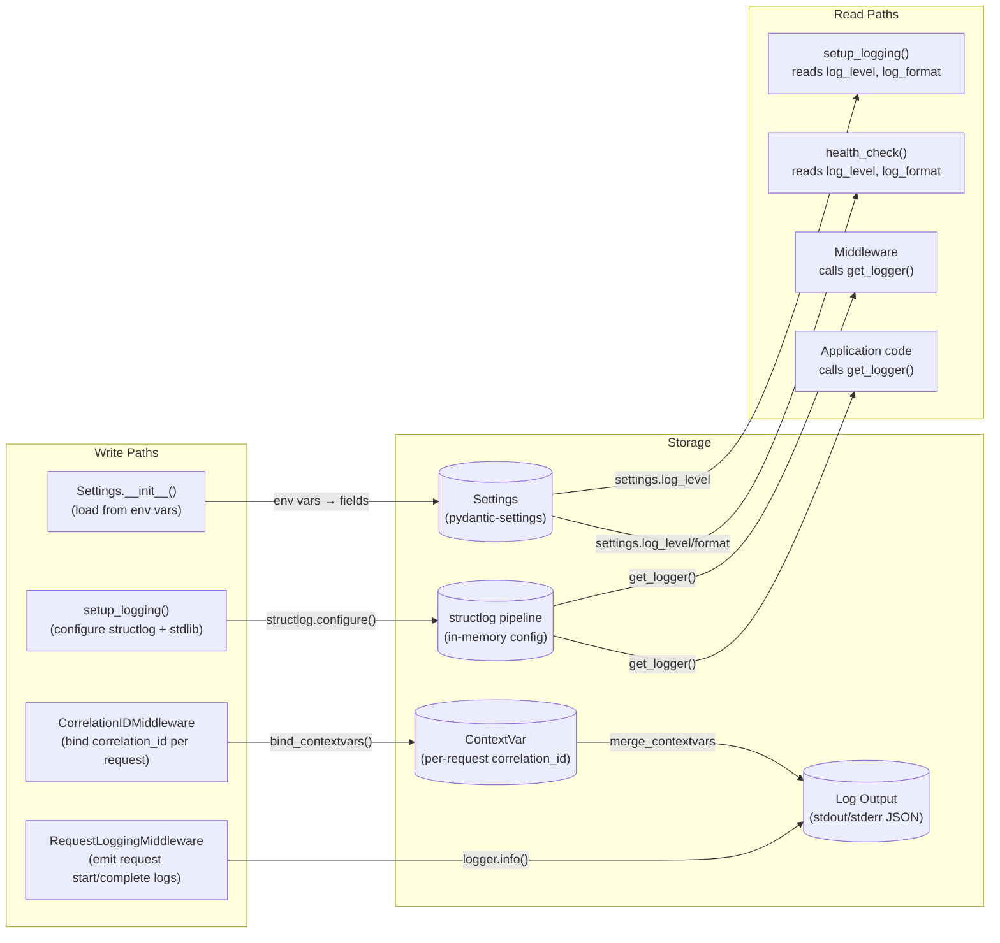
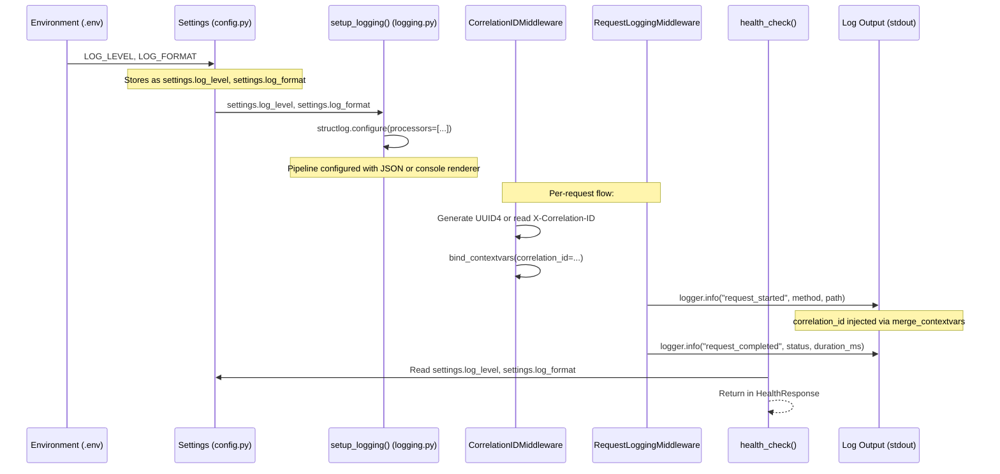
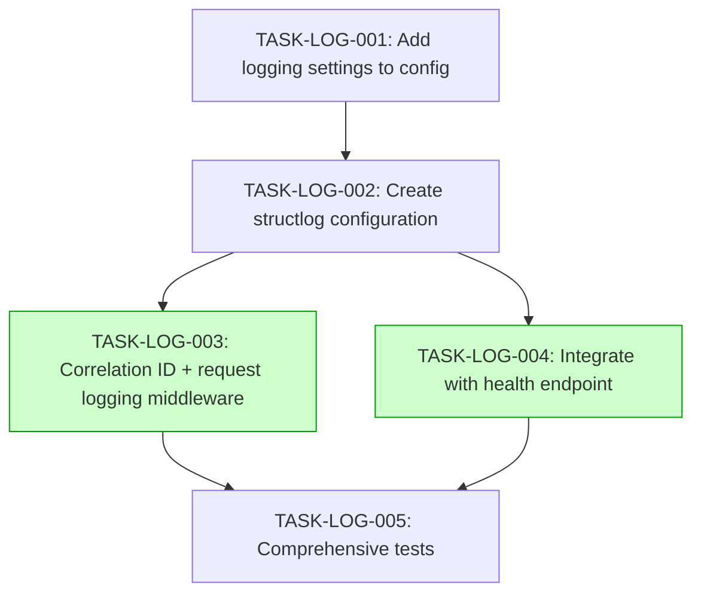

# Implementation Guide: Structured JSON Logging

## Overview

This guide covers the implementation of structured JSON logging with request correlation IDs, request/response logging middleware, and configurable log levels per environment for the FastAPI application.

**Approach**: structlog + stdlib logging integration
**Total Tasks**: 5
**Estimated Effort**: 4-5 hours
**Overall Complexity**: 6/10

## Data Flow: Read/Write Paths



_All write paths have corresponding read paths. No disconnections detected._

## Integration Contracts



_Data flows completely from environment through config, to logging setup, to middleware, to output. Health endpoint reads config directly._

## Task Dependencies



_Tasks with green background (TASK-LOG-003 and TASK-LOG-004) can run in parallel in Wave 3._

## Execution Strategy

### Wave 1: Foundation Config
| Task | Description | Mode | Complexity |
|------|------------|------|-----------|
| TASK-LOG-001 | Add logging settings to core config | direct | 2/10 |

**Files touched**: `src/core/config.py`, `.env.example`, `requirements/base.txt`

### Wave 2: Logging Infrastructure
| Task | Description | Mode | Complexity |
|------|------------|------|-----------|
| TASK-LOG-002 | Create structlog configuration module | task-work | 5/10 |

**Files touched**: `src/core/logging.py` (new), `src/main.py`

### Wave 3: Middleware + Health (Parallel)
| Task | Description | Mode | Complexity |
|------|------------|------|-----------|
| TASK-LOG-003 | Correlation ID + request logging middleware | task-work | 6/10 |
| TASK-LOG-004 | Integrate with health endpoint | direct | 3/10 |

**TASK-LOG-003 files**: `src/core/middleware.py`, `src/main.py`
**TASK-LOG-004 files**: `src/health/schemas.py`, `src/health/router.py`
**No file conflicts** - safe for parallel execution.

### Wave 4: Testing
| Task | Description | Mode | Complexity |
|------|------------|------|-----------|
| TASK-LOG-005 | Comprehensive tests | task-work | 5/10 |

**Files touched**: `tests/test_logging.py` (new), `tests/test_middleware.py`, `tests/health/test_router.py`, `tests/health/test_schemas.py`

## Section 4: Integration Contracts

### Contract: LOGGING_SETTINGS
- **Producer task:** TASK-LOG-001
- **Consumer task(s):** TASK-LOG-002
- **Artifact type:** Python class fields (pydantic Settings)
- **Format constraint:** `settings.log_level` must be a valid Python logging level string (DEBUG, INFO, WARNING, ERROR, CRITICAL); `settings.log_format` must be "json" or "console"
- **Validation method:** Coach verifies Settings class has `log_level: str` and `log_format: str` fields with correct defaults; unit test asserts valid values

### Contract: STRUCTLOG_LOGGER
- **Producer task:** TASK-LOG-002
- **Consumer task(s):** TASK-LOG-003, TASK-LOG-004
- **Artifact type:** Python module functions (`src/core/logging.py`)
- **Format constraint:** `get_logger(name: str)` must return a structlog BoundLogger; `setup_logging()` must configure both structlog and stdlib logging; correlation ID must be bindable via `structlog.contextvars.bind_contextvars(correlation_id=...)`
- **Validation method:** Coach verifies `get_logger()` returns a structlog logger instance; seam test verifies contextvars binding works

## Architecture Notes

### structlog Processor Pipeline

```
Input → add_log_level → timestamper → merge_contextvars → add_caller_info → renderer
                                            ↑
                                   correlation_id from ContextVar
```

- **JSON renderer** (`structlog.processors.JSONRenderer`): Used when `log_format == "json"` (production)
- **Console renderer** (`structlog.dev.ConsoleRenderer`): Used when `log_format == "console"` (development)

### Middleware Registration Order

In `main.py`, middleware is applied in reverse order (last added = outermost):
```python
app.add_middleware(RequestLoggingMiddleware)    # Inner: logs with correlation ID
app.add_middleware(CorrelationIDMiddleware)     # Outer: sets up correlation ID first
app.add_middleware(APIVersionHeaderMiddleware)  # Existing: adds version header
```

### Correlation ID Flow

1. Request arrives → `CorrelationIDMiddleware` generates/extracts UUID
2. UUID stored in `ContextVar` and bound to structlog via `bind_contextvars()`
3. All subsequent log calls within this request automatically include `correlation_id`
4. Response gets `X-Correlation-ID` header
5. After response, `unbind_contextvars()` cleans up

## Next Steps

1. Review this guide and the README.md
2. Start with Wave 1: `/task-work TASK-LOG-001`
3. Progress through waves sequentially
4. Wave 3 tasks can be run in parallel
