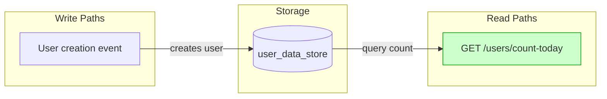

# Implementation Guide: Today's User Count Endpoint

## Overview
This feature implements a new endpoint to report the number of users created on the current day. It covers happy-path, boundary, and error cases.

## Data Flow: Read/Write Paths


Data flow shows the read path for the count endpoint depends on the user data store populated by creation events.

## Task Dependencies

```mermaid
graph TD
    T1[TASK-6D13-001: Create endpoint] --> T2[TASK-6D13-002: Implement query]
    T2 --> T3[TASK-6D13-003: Boundary tests]
    T3 --> T4[TASK-6D13-004: Error tests]
    T4 --> T5[TASK-6D13-005: Documentation]

    style T1 fill:#cfc,stroke:#090
    style T2 fill:#cfc,
    style T3 fill:#cfc
    style T4 fill:#cfc
    style T5 fill:#cfc
```
_Tasks with green background can run in parallel waves._

## Implementation Strategy

- **Wave 1**: Foundation (Endpoint creation)
- **Wave 2**: Data access (Query implementation)
- **Wave 3**: Boundary testing (Timezone boundaries)
- **Wave 4**: Error handling (Database failure, malformed requests)
- **Wave 5**: Documentation

## Deferred Planning Decisions

| Decision Point | Chosen Default | status |
|----------------|----------------|--------|
| Review focus | all | deferred |
| Trade-off priority | balanced | deferred |
| Approach selection | recommended | deferred |
| Execution preference | detect automatically | deferred |
| Testing depth | default | deferred |

## Implementation Notes

- Ensure the endpoint is UTC-aligned
- Database query must be efficient
- Error responses should follow API conventions