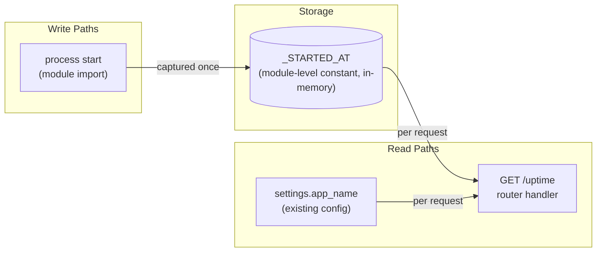

# Implementation Guide — Service Uptime Endpoint

**Feature slug**: uptime-endpoint · **Tasks**: 1 (single wave) · **Complexity**: 3/10
**Spec of record**: `features/uptime-endpoint/uptime-endpoint.feature` (5 scenarios, 3 confirmed assumptions)
**Provenance**: Mode P handoff `feature_spec_inputs/41a2e3ef-a941-4d8a-9e39-7124f71bf43c.md` → review `TASK-REV-8e9b` → this plan (Factory-1 pass, 2026-07-12)

## Approach (Option 1 from review)

Dedicated `src/uptime/` module mirroring `src/health/`: `router.py` +
`schemas.py` (Pydantic `UptimeResponse`), registered in `src/main.py`.
Start time captured once at process start; uptime computed per request;
zero database coupling.

## Data Flow: Read/Write Paths

*What to look for: one write (at import), two reads (both wired into the
handler). No disconnected paths — no Disconnection Alert. No database node
by design (the spec's edge-case scenario asserts this).*

## Task Dependencies

Single task, single wave — no dependency graph required (< 3 tasks).

- **Wave 1**: TASK-UPT-001 (direct mode)

## Integration Contracts

None — single task, no cross-task data dependencies (§4 omitted per template
rule). The only consumed artifact is the existing `settings.app_name`, already
present on `ddd-demo`.

## Autobuild Notes

- Base branch: `ddd-demo` (the repo's autobuild base of record).
- Suite gate: zero net-new failures vs the recorded baseline (155 passed /
  2 known env-drift middleware failures under `--forked`; see the Factory-1
  C2 pre-stage record in ai-transition).
- BDD `@task:` tagging deliberately skipped: `pytest-bdd` is not a project
  dependency, so the R2 task-level runner stays dormant for this target.
  The `.feature` file is the human-readable spec of record.
