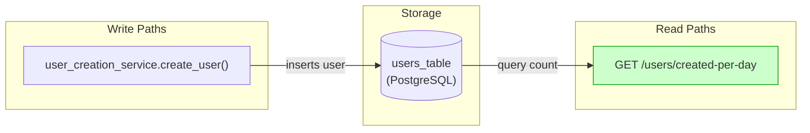
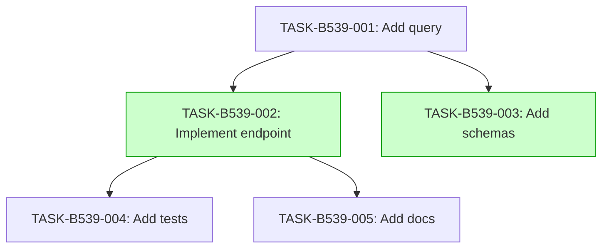

# Implementation Guide: User Creation Analytics

## Overview

This feature adds an analytics endpoint to monitor user growth trends.

## Data Flow: Read/Write Paths

*Read path from users table to analytics endpoint is wired.*

## §4: Integration Contracts

No cross-task data dependencies identified. All tasks are independent.

## Task Dependencies

*Tasks in green can run in parallel.*

## Execution Strategy

Wave 1: 1 task (foundation)
  ⚡ Conductor recommended
     • TASK-B539-001: Add query (direct, wave1-1)

Wave 2: 2 tasks (parallel)
  ⚡ Conductor recommended
     • TASK-B539-002: Implement endpoint (task-work, wave2-1)
     • TASK-B539-003: Add schemas (direct, wave2-2)

Wave 3: 1 task (depends on wave 2)
  ⚡ Conductor recommended
     • TASK-B539-004: Add tests (task-work, wave3-1)

Wave 4: 1 task (depends on wave 2)
  ⚡ Conductor recommended
     • TASK-B539-005: Add docs (direct, wave4-1)