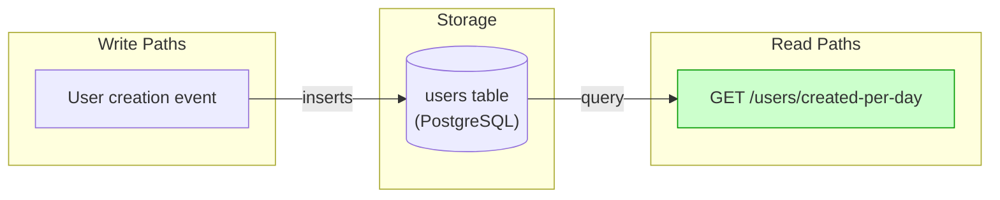
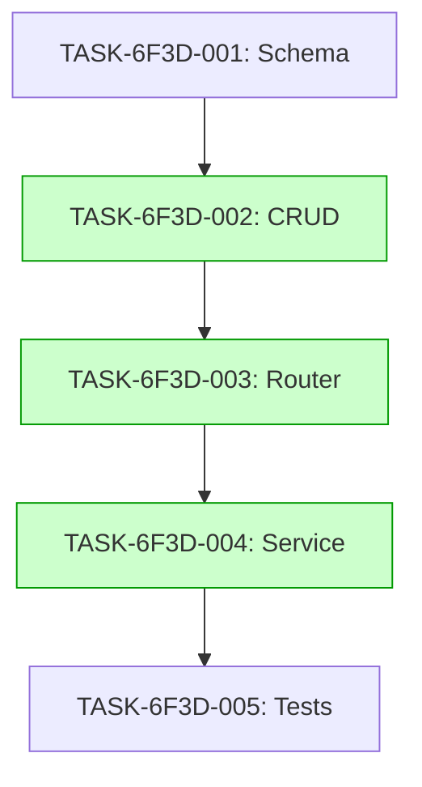

# Implementation Guide: User Creation Analytics - Daily Counts

## Overview

This feature implements a new analytics endpoint that provides a 7-day rolling window of user creation counts.

## Architecture

*Data flow: User creation writes to the users table, which is then queried by the analytics endpoint.*

## Integration Contracts

### Contract: user_creation_counts
- **Producer task:** TASK-6F3D-002
- **Consumer task(s):** TASK-6F3D-003
- **Artifact type:** Pydantic schema (List[UserCount])
- **Format constraint:** List of objects with 'date' (ISO-8601) and 'count' (non-negative int) keys
- **Validation method:** Coach verifies response schema matches Pydantic model

## Task Dependencies

*Tasks with green background can run in parallel if Conductor is used.*

## Implementation Strategy

1. **Data Model**: Add analytics-specific fields or a separate table if needed.
2. **CRUD**: Implement the query logic using SQLAlchemy 2.0.
3. **Router**: Expose the endpoint with appropriate Pydantic schemas.
4. **Service**: Orchestrate the data retrieval and formatting.
5. **Testing**: Add integration tests covering all scenarios from the feature spec.

## Deferred Decisions

| Decision Point | Chosen Default | Status |
|---|---|---|
| Storage approach | Use existing users table with created_at index | deferred |
| Response format | JSON array of objects with date and count | deferred |
| Timezone handling | UTC for all calculations | deferred |