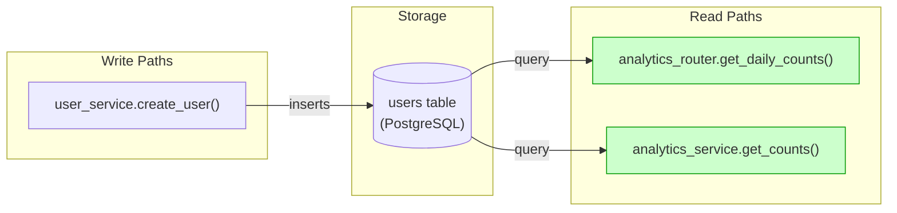
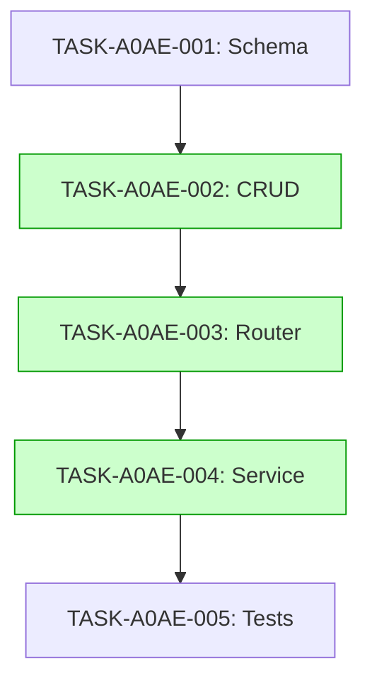

# Implementation Guide: User Creation Analytics - Daily Counts

This guide outlines the implementation strategy for the daily user creation analytics feature.

## Architecture

The feature follows the project's existing modular structure. All modified files are located within `src/users/` or a new `src/analytics/` module.

### Data Flow

*All read paths are wired and testable.*

## Task Dependencies

*Tasks with green background can run in parallel.*

## Integration Contracts

### Contract: daily_counts_response
- **Producer task:** TASK-A0AE-002
- **Consumer task(s):** TASK-A0AE-003
- **Artifact type:** Pydantic model
- **Format constraint:** List of objects with `date` (ISO8601) and `count` (int)
- **Validation method:** Coach verifies router returns the model shape

## Execution Strategy

Wave 1: 1 task (sequential)
  ⚡ Conductor recommended
     • TASK-A0AE-001: Create analytics schema (direct, wave1-1)

Wave 2: 1 task (sequential)
  ⚡ Conductor recommended
     • TASK-A0AE-002: Implement analytics CRUD (task-work, wave2-1)

Wave 3: 1 task (sequential)
  ⚡ Conductor recommended
     • TASK-A0AE-003: Add analytics router (task-work, wave3-1)

Wave 4: 1 task (sequential)
  ⚡ Conductor recommended
     • TASK-A0AE-004: Implement analytics service (task-work, wave4-1)

Wave 5: 1 task (sequential)
  ⚡ Conductor recommended
     • TASK-A0AE-005: Add analytics tests (direct, wave5-1)

## Implementation Notes

- Use SQLAlchemy 2.0 `select()` with `func.count()`
- Ensure the query is timezone-aware
- Add integration tests in `tests/analytics/`
- All modified files must pass project-configured lint/format checks with zero errors