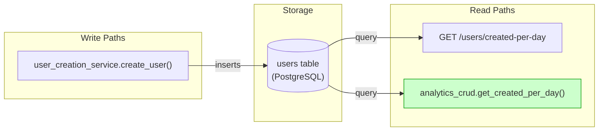
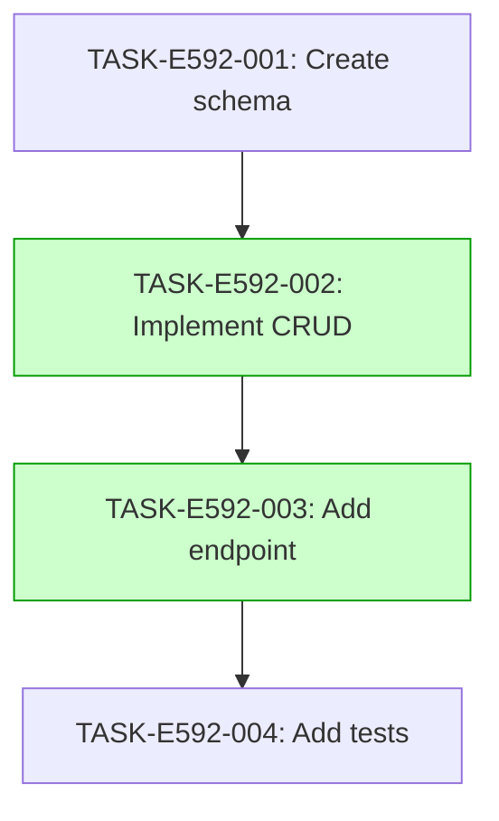

# Implementation Guide: User Creation Analytics - Created Per Day

This guide outlines the implementation plan for the `GET /users/created-per-day` endpoint.

## Architecture

The feature follows the project's existing architecture patterns.

*Data flow: Write path from user creation to users table, read path from users table to analytics endpoint.*

## Integration Contracts

This feature does not introduce cross-task data dependencies that require a §4 contract. All tasks are independent or consume data via the existing database.

## Task Dependencies

_Tasks with green background can run in parallel._

## Execution Strategy

Wave 1: 1 task (sequential)
  ⚡ Conductor recommended
     • TASK-E592-001: Create schema (direct, wave1-1)

Wave 2: 1 task (sequential)
  ⚡ Conductor recommended
     • TASK-E592-002: Implement CRUD (task-work, wave2-1)

Wave 3: 1 task (sequential)
  ⚡ Conductor recommended
     • TASK-E592-003: Add endpoint (task-work, wave3-1)

Wave 4: 1 task (sequential)
  ⚡ Conductor recommended
     • TASK-E592-004: Add tests (direct, wave4-1)

## Subtasks

See individual task files in `tasks/backlog/user-creation-analytics/` for details.