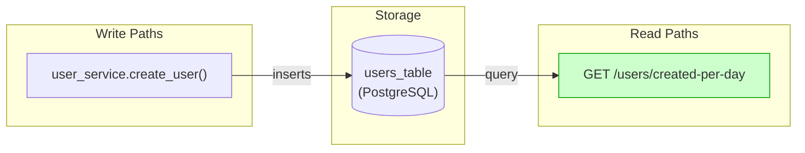
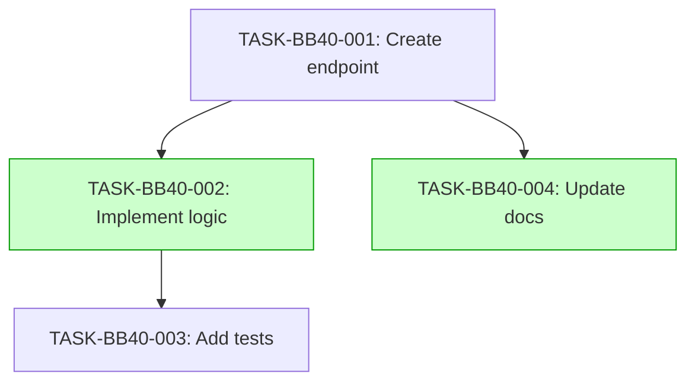

# Implementation Guide: User Creation Daily Counts

This feature implements the daily user creation counts endpoint.

## Architecture

The endpoint reads from the user database and returns counts for the last 7 days.

*Data flow: user creation writes to users_table; endpoint reads from it.*

## §4: Integration Contracts

No cross-task data dependencies identified for this feature.

## Task Dependencies

*Tasks with green background can run in parallel.*

## Execution Strategy

Wave 1: 1 task (foundation)
  ⚡ Conductor recommended
     • TASK-BB40-001: Create endpoint (direct, wave1-1)

Wave 2: 2 tasks (parallel)
  ⚡ Conductor recommended
     • TASK-BB40-002: Implement logic (task-work, wave2-1)
     • TASK-BB40-004: Update docs (direct, wave2-2)

Wave 3: 1 task (final)
  ⚡ Conductor recommended
     • TASK-BB40-003: Add tests (direct, wave3-1)