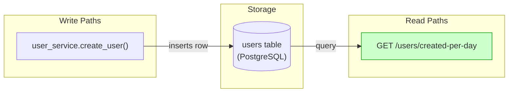
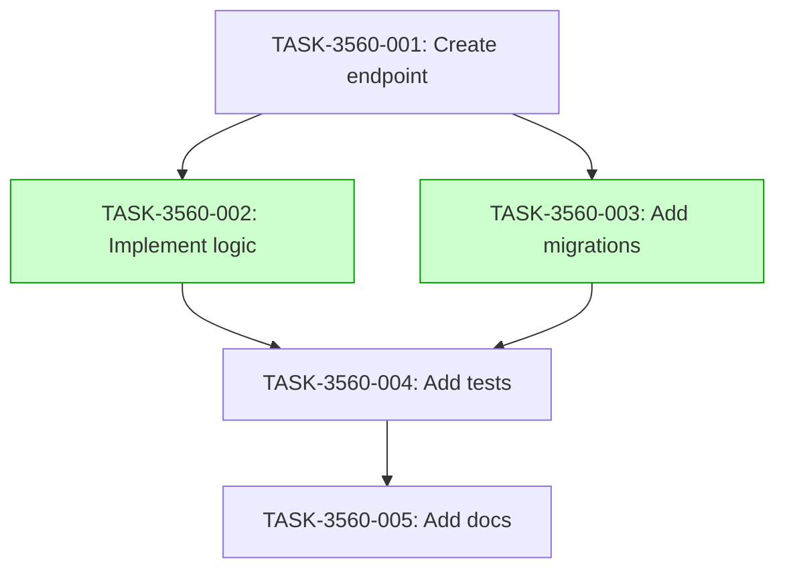

# Implementation Guide: User Creation Daily Counts

## Overview

This feature implements an endpoint to retrieve user creation counts for the last 7 days.

## Data Flow: Read/Write Paths

*Read path is covered by endpoint tests.*

## Integration Contracts

### Contract: user_creation_counts
- **Producer task:** TASK-3560-002
- **Consumer task(s):** TASK-3560-004
- **Artifact type:** JSON response
- **Format constraint:** Array of objects with `date` (ISO 8601) and `count` (integer)
- **Validation method:** Endpoint tests verify response schema and content

## Task Dependencies

_Tasks with green background can run in parallel._

## Execution Strategy

Wave 1: 1 task (sequential)
  ⚡ Conductor recommended
     • TASK-3560-001: Create endpoint (direct, wave1-1)

Wave 2: 2 tasks (parallel)
  ⚡ Conductor recommended
     • TASK-3560-002: Implement logic (task-work, wave2-1)
     • TASK-3560-003: Add migrations (task-work, wave2-2)

Wave 3: 1 task (sequential)
  ⚡ Conductor recommended
     • TASK-3560-004: Add tests (task-work, wave3-1)

Wave 4: 1 task (sequential)
  ⚡ Conductor recommended
     • TASK-3560-005: Add docs (direct, wave4-1)

## Deferred Planning Decisions

| decision point | chosen default | status |
|----------------|----------------|--------|
| review_focus | all | deferred |
| trade_off_priority | balanced | deferred |
| implementation_approach | recommended | deferred |
| execution_preference | auto-detect | deferred |
| testing_depth | default | deferred |