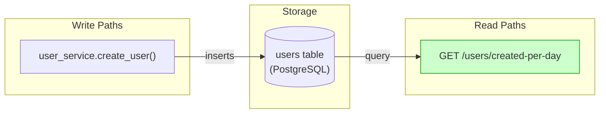
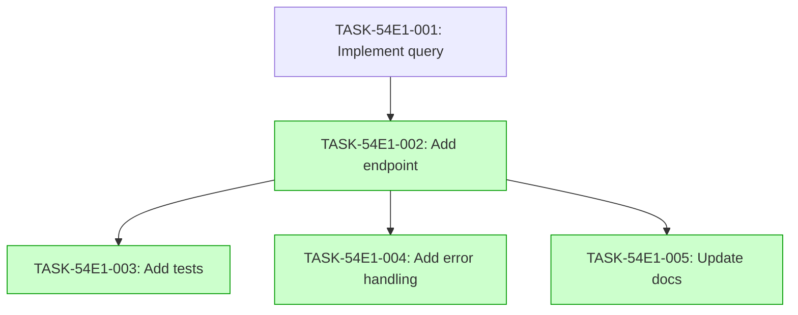

# Implementation Guide: User Creation Daily Counts

This feature implements a new endpoint that returns the number of users created on each of the last 7 days, ordered oldest first.

## Architecture

The feature follows the project's architecture patterns:
- **Router**: `src/users/router.py` defines the endpoint.
- **CRUD**: `src/users/crud.py` implements the database query.
- **Schemas**: `src/users/schemas.py` defines the response shape.
- **Models**: `src/users/models.py` (existing) contains the user model.

## Data Flow

*Data flow: user creation writes to the database, which the daily counts endpoint reads.*

## Integration Contracts

The following contract defines the data flow between the CRUD layer and the router.

### Contract: daily_counts_response
- **Producer task:** TASK-54E1-001
- **Consumer task(s):** TASK-54E1-002
- **Artifact type:** Pydantic model
- **Format constraint:** List of objects with `date` (ISO 8601) and `count` (integer)
- **Validation method:** Coach verifies the router returns the Pydantic model shape

## Task Dependencies

*Tasks with green background can run in parallel.*

## Execution Strategy

Wave 1: 1 task (sequential)
  ⚡ Conductor recommended
     • TASK-54E1-001: Implement query (task-work, wave1-1)

Wave 2: 3 tasks (parallel)
  ⚡ Conductor recommended
     • TASK-54E1-002: Add endpoint (task-work, wave2-1)
     • TASK-54E1-003: Add tests (direct, wave2-2)
     • TASK-54E1-004: Add error handling (direct, wave2-3)

Wave 3: 1 task (sequential)
  ⚡ Conductor recommended
     • TASK-54E1-005: Update docs (direct, wave3-1)

## Implementation Notes

- Use SQLAlchemy 2.0 `select()` syntax
- Ensure the 7-day window is inclusive of the oldest day
- All modified files must pass project-configured lint/format checks with zero errors
- All modified files must pass project-configured lint/format checks with zero errors