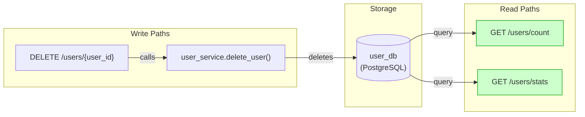
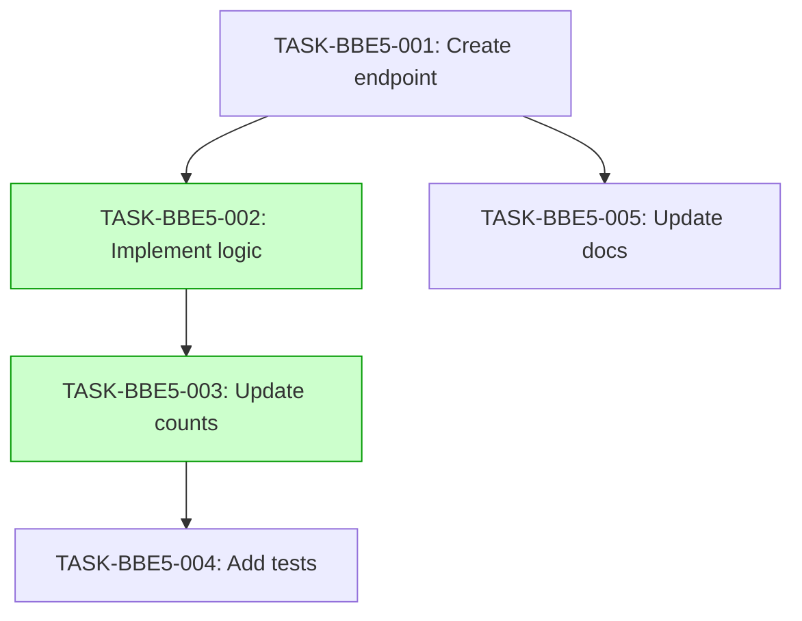

# Implementation Guide: User Deletion API

## Overview

This feature implements the user deletion endpoint and ensures that user counts are reflected in real-time.

## Data Flow: Read/Write Paths

*All read paths are wired to the database and reflect deletions in real-time.*

## §4: Integration Contracts

No cross-task data dependencies identified for this feature.

## Task Dependencies

*Tasks with green background can run in parallel.*

## Execution Strategy

Wave 1: 1 task (sequential)
  ⚡ Conductor recommended
     • TASK-BBE5-001: Create endpoint (direct, wave1-1)

Wave 2: 2 tasks (parallel)
  ⚡ Conductor recommended
     • TASK-BBE5-002: Implement logic (task-work, wave2-1)
     • TASK-BBE5-003: Update counts (task-work, wave2-2)

Wave 3: 1 task (sequential)
  ⚡ Conductor recommended
     • TASK-BBE5-004: Add tests (task-work, wave3-1)

Wave 4: 1 task (sequential)
  ⚡ Conductor recommended
     • TASK-BBE5-005: Update docs (direct, wave4-1)