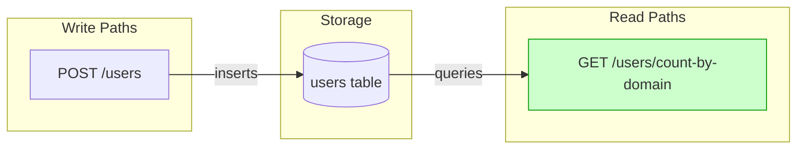
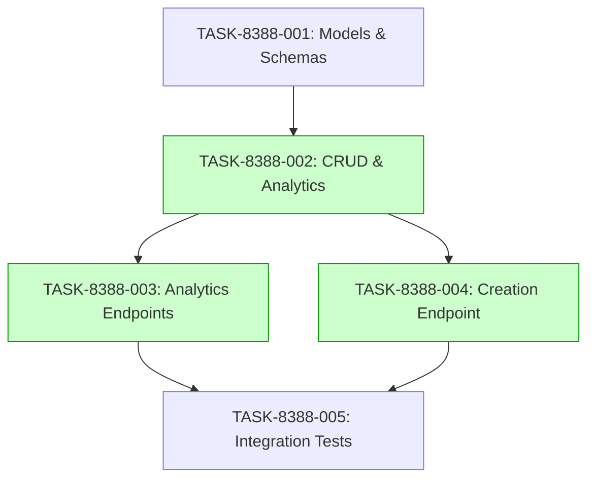

# Implementation Guide: User Domain Analytics and User Creation Extension

This guide outlines the implementation strategy for the User Domain Analytics and User Creation feature.

## Architecture

The feature implements user domain analytics and user creation functionality.


*Data flow: User creation writes to users table, which is queried by domain analytics endpoint.*

## Integration Contracts

```markdown
## §4: Integration Contracts

### Contract: user_domain_counts
- **Producer task:** TASK-8388-002
- **Consumer task(s):** TASK-8388-003
- **Artifact type:** domain count dictionary
- **Format constraint:** dictionary with domain names as keys and integer counts as values
- **Validation method:** Coach verifies TASK-8388-003 test asserts on the response format
```

## Task Dependencies


*Tasks with green background can run in parallel.*

## Execution Strategy

Wave 1: 1 task (sequential)
  ⚡ Conductor recommended
     • TASK-8388-001: Create user models and schemas (direct, wave1-1)

Wave 2: 1 task (sequential)
  ⚡ Conductor recommended
     • TASK-8388-002: Implement user CRUD and analytics logic (task-work, wave2-1)

Wave 3: 2 tasks (parallel)
  ⚡ Conductor recommended
     • TASK-8388-003: Add user domain analytics endpoints (task-work, wave3-1)
     • TASK-8388-004: Implement user creation endpoint (task-work, wave3-2)

Wave 4: 1 task (sequential)
  ⚡ Conductor recommended
     • TASK-8388-005: Add integration tests for user endpoints (direct, wave4-1)

## Deferred Planning Decisions

| decision point | chosen default | status |
|---|---|---|
| review focus | all | deferred |
| trade-off priority | balanced | deferred |
| implementation approach | recommended | deferred |
| execution preference | detect automatically | deferred |
| testing depth | default based on complexity | deferred |