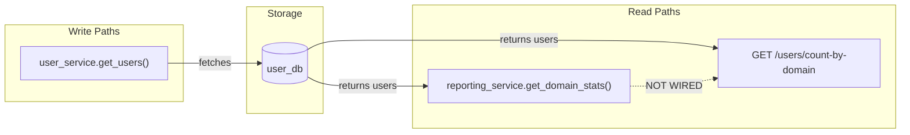
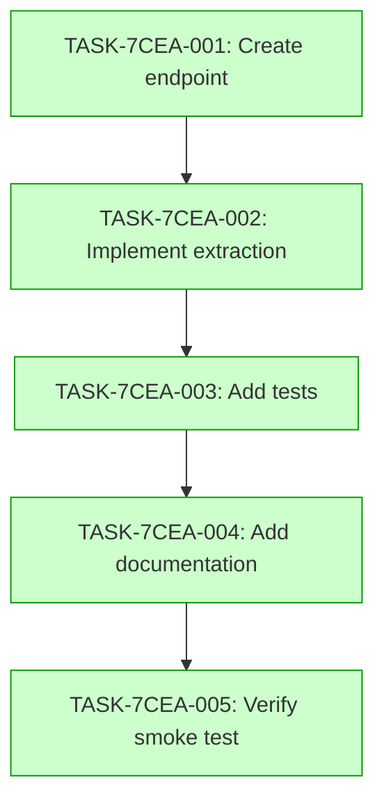

# Implementation Guide: User Domain Count API

## Overview

This feature implements a GET /users/count-by-domain endpoint that returns the number of users grouped by email domain, ordered by count descending.

## Data Flow

*Note: R2 is a future integration point for reporting services.*

## Integration Contracts

### Contract: domain_count_endpoint
- **Producer task:** TASK-7CEA-001
- **Consumer task(s):** TASK-7CEA-003, TASK-7CEA-005
- **Artifact type:** HTTP response
- **Format constraint:** JSON array of {domain: string, count: number}
- **Validation method:** Hurl tests validating status code and JSON structure

## Task Dependencies

*Tasks in green can run in parallel if dependencies are met.*

## Execution Strategy

Wave 1: 1 task
  ⚡ TASK-7CEA-001: Create domain count endpoint (direct)

Wave 2: 1 task
  ⚡ TASK-7CEA-002: Implement domain extraction logic (task-work)

Wave 3: 1 task
  ⚡ TASK-7CEA-003: Add domain count tests (task-work)

Wave 4: 1 task
  ⚡ TASK-7CEA-004: Add documentation (direct)

Wave 5: 1 task
  ⚡ TASK-7CEA-005: Verify endpoint with smoke test (direct)

## Deferred Planning Decisions

| decision point | chosen default | status |
|---|---|---|
| review_focus | all aspects | deferred |
| tradeoff_priority | balanced | deferred |
| approach_selection | recommended | deferred |
| execution_preference | auto-detect | deferred |
| testing_depth | default | deferred |
| mode_boundary_normalization | task-work (>=4) / direct (<4) | deferred |