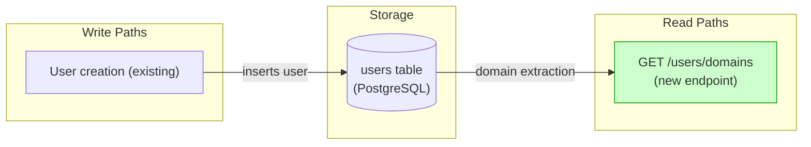
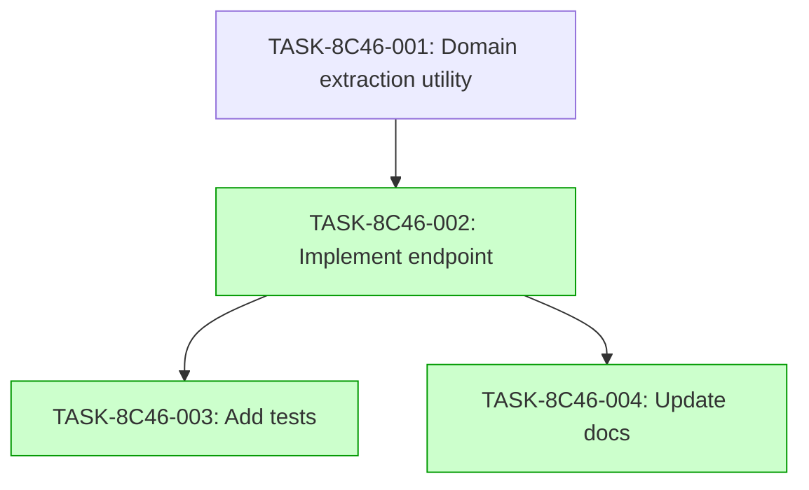

# Implementation Guide: User Domain Discovery

This feature implements the GET /users/domains endpoint to provide insights into the distribution of user email domains.

## Architecture

The feature follows the project's existing architecture patterns.

*Data flow: User creation writes to the users table; the domains endpoint reads from it.*

## Integration Contracts

This feature does not introduce new cross-task data dependencies between the planned subtasks.

## Task Dependencies

*Tasks with green background can run in parallel.*

## Execution Strategy

Wave 1: 1 task (foundation)
  ⚡ Conductor recommended
     • TASK-8C46-001: Create domain extraction utility (direct, wave1-1)

Wave 2: 1 task (implementation)
  ⚡ Conductor recommended
     • TASK-8C46-002: Implement domain discovery endpoint (task-work, wave2-1)

Wave 3: 2 tasks (parallel execution)
  ⚡ Conductor recommended
     • TASK-8C46-003: Add domain discovery tests (direct, wave3-1)
     • TASK-8C46-004: Update API documentation (direct, wave3-2)