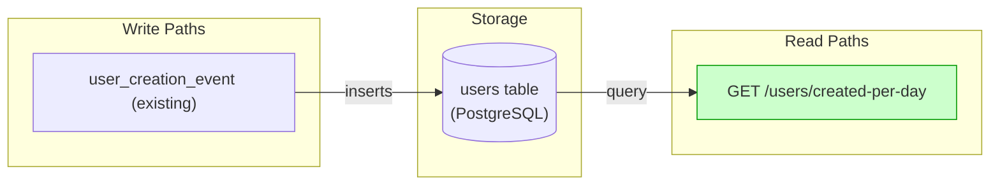
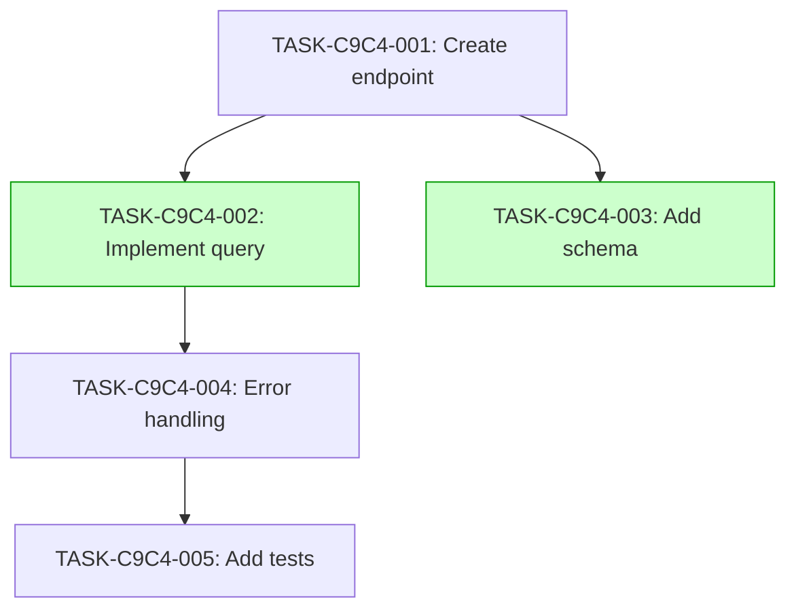

# Implementation Guide: User Creation Metrics

This guide outlines the implementation approach for the User Creation Metrics feature.

## Architecture

The feature adds a new endpoint to the user analytics domain.

*Data flow: user creation events are stored in the users table and queried by the metrics endpoint.*

## Integration Contracts

No cross-task data dependencies identified.

## Task Dependencies

*Tasks with green background can run in parallel.*

## Implementation Strategy

Wave 1:
- TASK-C9C4-001: Create endpoint (direct)
- TASK-C9C4-002: Implement query (task-work)
- TASK-C9C4-003: Add schema (direct)

Wave 2:
- TASK-C9C4-004: Error handling (task-work)

Wave 3:
- TASK-C9C4-005: Add tests (task-work)