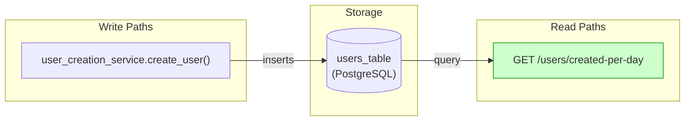
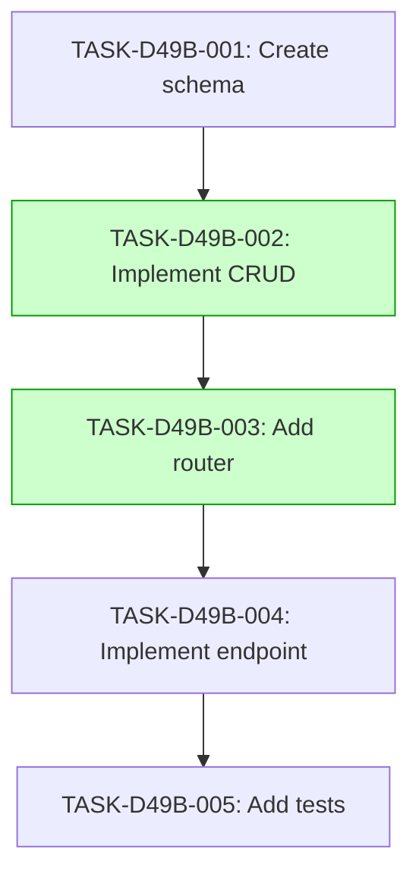

# Implementation Guide: Daily User Creation Count

## Overview

This feature implements the daily user creation count endpoint.

## Data Flow: Read/Write Paths

The data flow diagram shows the write path from user creation to the users table and the read path from the endpoint.

## §4: Integration Contracts

No cross-task data dependencies identified for this feature.

## Task Dependencies

_Tasks with green background can run in parallel._