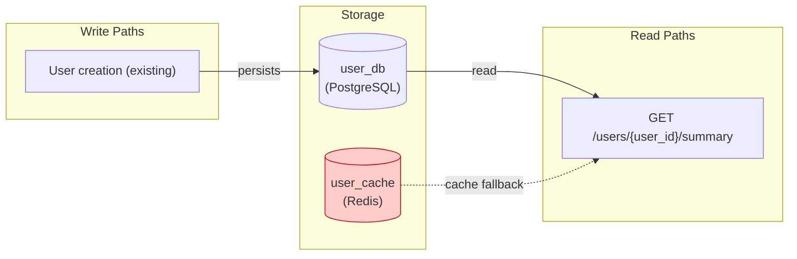
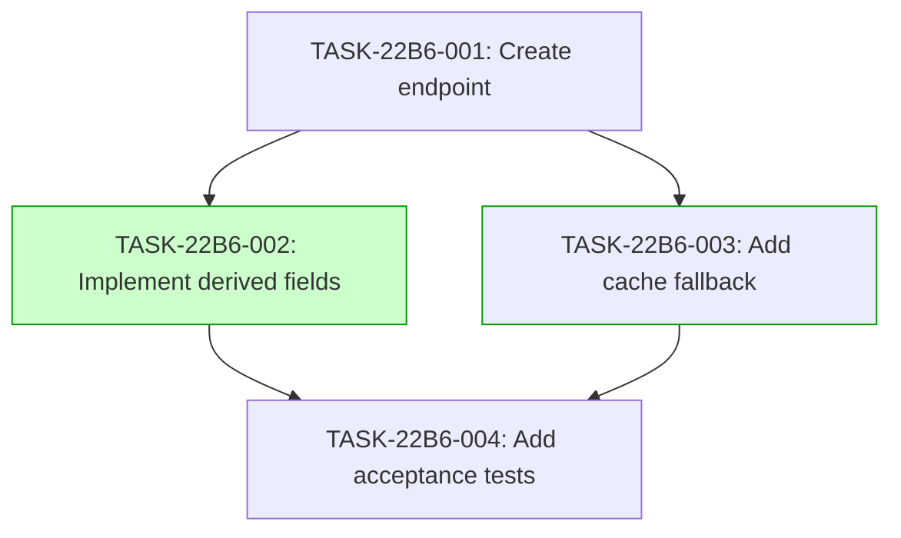

## Overview

This guide details the implementation plan for the User Summary Endpoint feature. The endpoint provides a enriched public view of user data, including derived fields and cache-aware error handling.

## Data Flow Diagram

## Task Dependency Graph

## Implementation Strategy

The implementation follows a three-wave approach:
1. Foundation (Wave 1): Establish the endpoint structure and basic data retrieval.
2. Enhancement (Wave 2): Add derived field calculations and cache fallback logic in parallel.
3. Verification (Wave 3): Run acceptance tests covering all boundary conditions.

## Deferred Planning Decisions

| Decision Point | Chosen Default | status |
|----------------|----------------|--------|
| Review focus | all | deferred |
| Trade-off priority | balanced | deferred |
| Implementation approach | recommended | deferred |
| Execution preference | detect automatically | deferred |
| Testing depth | default | deferred |

## Engineering Notes

- Ensure the endpoint is idempotent
- Cache keys should include the user ID and a version prefix
- Error messages should be clear and actionable for clients
