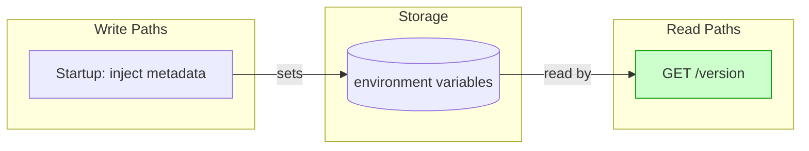
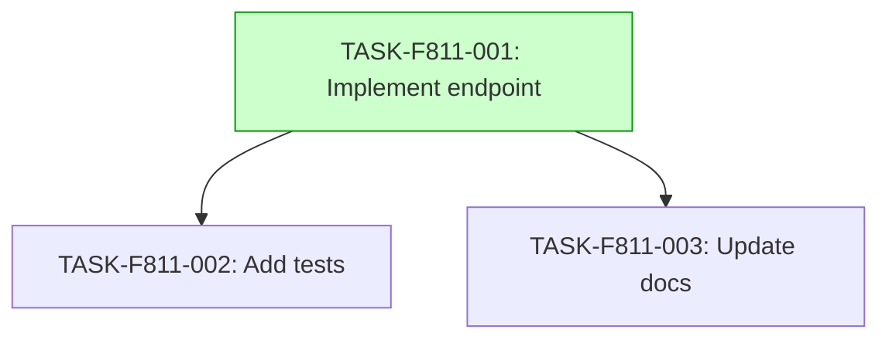

# Implementation Guide: Version Endpoint

## Overview

This feature implements a `/version` endpoint to expose application metadata.

## Data Flow

*Data flow shows metadata injected at startup and read by the version endpoint.*

## Task Dependencies

*Tasks 2 and 3 can run in parallel after Task 1 completes.*

## Execution Strategy

Wave 1:
- TASK-F811-001 (direct)

Wave 2:
- TASK-F811-002 (direct)
- TASK-F811-003 (direct)

## Implementation Notes

- Use environment variables for version and commit hash
- Ensure JSON response format
- Add Hurl tests in `tests/version/`

## Deferred Planning Decisions

| decision point | chosen default | status |
|---|---|---|
| review focus | all | deferred |
| trade-off priority | balanced | deferred |
| implementation approach | recommended | deferred |
| execution preference | auto-detect | deferred |
| testing depth | default | deferred |
| smoke gates | omitted (test_roots match) | deferred |
| evidence repos | none | deferred |