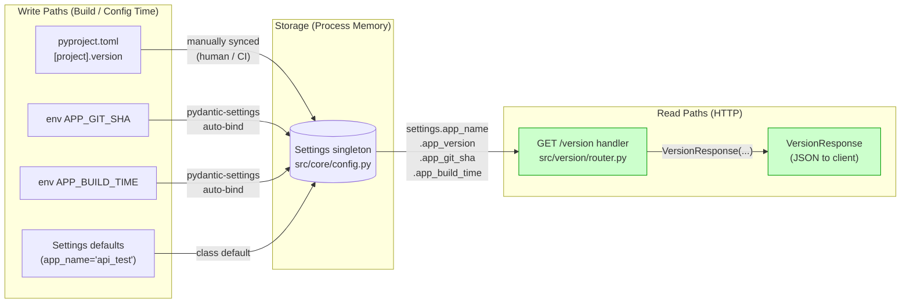

# Implementation Guide: GET /version endpoint

## Feature Summary

Expose service version metadata at `GET /version` returning service name,
version, git SHA, and build time. Mirrors the structural shape of
`src/health/` but keeps the response schema inline in `router.py`. Single
task, single wave, ~30 min wall-clock.

## Data Flow: Read/Write Paths



_Look for: every write path has a matching read path (no dotted "NOT WIRED"
arrows). `pyproject.toml → Settings.app_version` is a manual sync (same
pattern `/health` already uses) — the build pipeline / human is responsible
for keeping them aligned. There are no disconnected reads or writes._

**Disconnection check**: No disconnected paths. All four `Settings` fields
(`app_name`, `app_version`, `app_git_sha`, `app_build_time`) are read by the
`/version` handler.

## Architecture Notes

- **Pattern**: feature-module layout under `src/{feature}/`, identical to
  `src/health/`. Tests mirrored at `tests/{feature}/`.
- **Schema location**: inline in `src/version/router.py` (per spec). This is
  a deliberate divergence from `/health` which uses `src/health/schemas.py` —
  rationalised by the smaller surface area (one response model, no request
  models, no foreseeable schema growth).
- **Config flow**: all four response fields originate in
  `Settings` (`src/core/config.py`). The handler does NOT read environment
  variables directly — pydantic-settings handles env binding once, at
  module import.
- **No runtime `git` shell-out**: `APP_GIT_SHA` is the only path. CI/Docker
  is responsible for injecting it at build time.

## Task Breakdown

| Task ID | Title | Complexity | Mode | Wave |
|---|---|---|---|---|
| TASK-VER-001 | Add GET /version endpoint | 3 | task-work | 1 |

Single task — settings + router + test + main.py wiring are tightly coupled
(small file count, tight blast radius) so splitting would only add
wall-clock without value.

## Execution Strategy

- **Wave 1**: TASK-VER-001 (single task, no dependencies)
- **No parallel execution** — single task
- **Estimated wall-clock**: 25–40 min

## Files Touched

| File | Action | Reason |
|---|---|---|
| `src/core/config.py` | modify | Add `app_git_sha`, `app_build_time`; bump `app_name` default to `"api_test"` |
| `src/version/__init__.py` | create | Module marker |
| `src/version/router.py` | create | Router + inline `VersionResponse` schema |
| `src/main.py` | modify | Import + `include_router(version_router)` + `openapi_tags` entry |
| `tests/version/__init__.py` | create | Test module marker |
| `tests/version/test_router.py` | create | Happy-path test |

## Verification Steps

The Coach will run, in order:

```bash
pytest tests/version/ -v
pytest --cov=src --cov-report=term --cov-fail-under=80
mypy src/
ruff check src/ tests/
ruff format --check src/ tests/
```

The full test suite (not just the new test) must continue to pass — the
`app_name` default change is the only existing-behaviour change and it
affects only OpenAPI metadata, not any response payload, so existing tests
should remain green without modification.

## Risk Register

| Risk | Likelihood | Mitigation |
|---|---|---|
| `app_name` default change breaks an existing test asserting `"api"` | Low | `grep -rn '"api"' tests/` before implementing; expected zero hits |
| `pydantic-settings` env-binding semantics differ from assumption | Low | Existing `app_version` field demonstrates the pattern works |
| Coverage drops below 80% line | Low | `/version` handler is 5 lines of straight-line code, trivially covered by the happy-path test |
| Test asserts `version == "0.1.0"` and pyproject.toml later bumps without updating Settings | Low | Same coupling exists today for `/health`; out-of-scope to fix here |

## Next Steps After Implementation

After this task is approved and merged, follow-up work (deliberately NOT in
this feature):

1. CI injection: add `APP_GIT_SHA=$(git rev-parse --short HEAD)` and
   `APP_BUILD_TIME=$(date -u +%Y-%m-%dT%H:%M:%SZ)` to the Dockerfile /
   deploy script.
2. (Optional) Add a second test asserting that when `APP_GIT_SHA` env var
   IS set, the endpoint reflects it. Requires `monkeypatch` and reloading
   the Settings singleton.
3. (Optional) Switch `version` source to `importlib.metadata.version("api_test")`
   to eliminate the manual `pyproject.toml ↔ Settings.app_version` sync.
