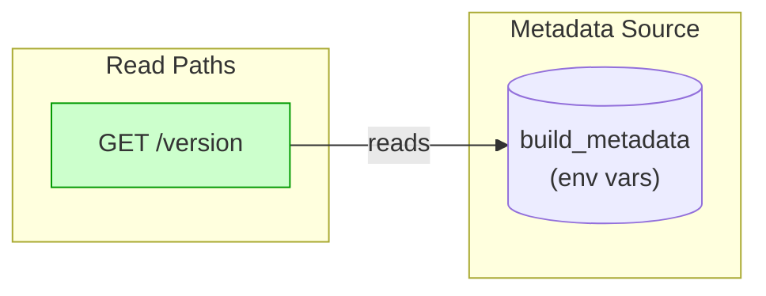
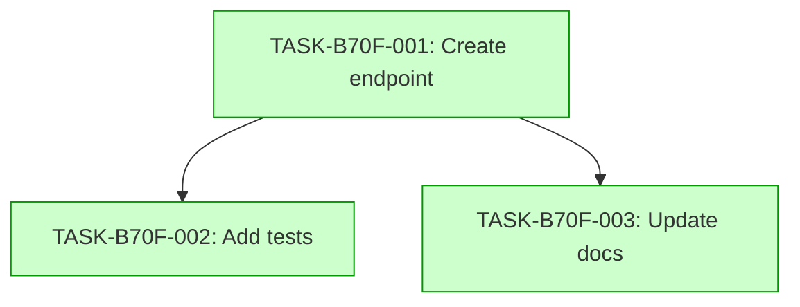

# Implementation Guide: Version Endpoint

## Overview
This feature adds a read-only `/version` endpoint to the `api_test` service, exposing build metadata.

## Data Flow: Read/Write Paths

The data flow is simple: the endpoint reads from environment variables populated at build time.

## Task Dependencies

Tasks in wave 1 (T1) must complete before wave 2 tasks (T2, T3) begin.

## Implementation Strategy

1. **Infrastructure**: Configure environment variable extraction in the application startup
2. **Endpoint**: Implement GET handler for `/version`
3. **Validation**: Add tests covering happy path, boundary conditions, and negative cases
4. **Documentation**: Update API docs with endpoint specification

## Risk Assessment

- **Low Risk**: The endpoint is read-only and does not touch the database
- **Low Risk**: No authentication required — public contract

## Timeline

- Wave 1: Endpoint creation (45m)
- Wave 2: Testing and documentation (50m)
- Total estimated duration: 95m